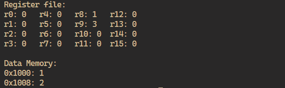

# Y86 Emulator

## Introduction


This software emulates the Y86 instruction set architecture, a simplified version of the x86 architecture from the book *Computer Systems: A Programmer's Perspective*. Write your program in an .asm file and execute the assembler to load the data onto the CPU. Then view the state of the register file and data memory to see how the instructions have changed the CPU state. Learn the [y86 ISA](https://w3.cs.jmu.edu/lam2mo/cs261_2018_08/files/y86-isa.pdf) to understand how to program the CPU. 


## Getting Started
You can build and run the project yourself, in which case you'll have to install Go. Alternatively, you can simply execute the y86 executable in the repository.

### Building the project
1. Install [Go](https://go.dev/) if you don't have it already
2. Clone the repository
3. Run the command ```go run main.go <filename>``` 


### Run the executable
1. Run the command ```./y86 <filename>``` 

After running the program you should see the contents of the register file and data memory on the terminal. 

## Acknowledgments

- Inspired by the educational material provided by [Computer Systems: A Programmer's Perspective](http://csapp.cs.cmu.edu/)